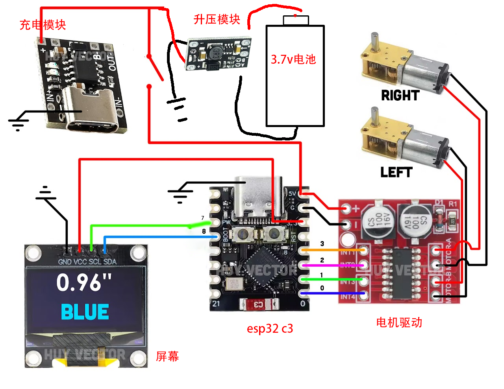
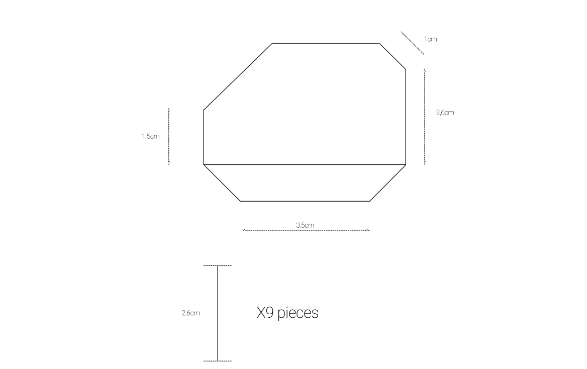

# Mochan 🐱



一只桌面机器人小猫，基于 ESP32-C3 + SSD1306 OLED。

既能当桌面时钟/天气站（休眠模式画一只睡觉的小猫），又能用网页遥控它走来走去（双 H 桥电机驱动）。三种"心情"模式，每种都有对应的 OLED 动画：

- **休眠**：屏幕上一只小猫睡觉/摇尾巴/醒来走动/比心，背景带昼夜天空、月亮、星星、天气元素
- **摇摆**：RoboEyes 大眼睛动画 + 随机左右转头
- **好奇**：RoboEyes 大眼睛动画 + 随机四处走动

## 硬件

| 部件 | 型号 |
|---|---|
| 主控 | ESP32-C3 DevKit（带 USB CDC，无需额外 USB 芯片） |
| 屏幕 | SSD1306 OLED 128×64，I2C |
| 电机驱动 | 双 H 桥（TB6612 / L298 类，4 路 PWM 控制双电机正反转） |
| 电机 | 两个 N20 减速电机（左右各一） |
| 电源 | 锂电池 3.7V + MT3608 升压模块（升到 5V） |

### ⚠️ 电源说明（重要）

**ESP32-C3 不能直接接 3.7V 锂电池！** 锂电池满电 4.2V 会超过芯片 3.6V 上限烧板子，放电时电压又不够稳。

必须加 **MT3608 升压模块**（3.7V → 5V），接线：

```
锂电池 + ──[开关]── MT3608 IN+
锂电池 - ────────── MT3608 IN-

MT3608 OUT+ (5V) ──┬── ESP32 5V 引脚
                   └── 电机驱动器 VMOTOR
MT3608 OUT- (GND) ─┬── ESP32 GND
                   └── 电机驱动器 GND
```

> **接 ESP32 前必须用万用表调电位器到 5.0V！** MT3608 出厂默认可能输出 15V+，直接接会烧板子。

如果电机启动时 brownout 重启，在升压模块 OUT+ 和 OUT- 之间加一个 **100μF 电解电容** 滤波。

### 接线

```
ESP32-C3          SSD1306 OLED
GPIO8  ────────── SDA
GPIO7  ────────── SCL
3V3    ────────── VCC
GND    ────────── GND

ESP32-C3          电机驱动（H 桥）
GPIO0  ────────── 左电机前进 (LF)
GPIO1  ────────── 左电机后退 (LB)
GPIO2  ────────── 右电机前进 (RF)
GPIO3  ────────── 右电机后退 (RB)
GPIO10 ────────── STBY（待机控制）
GND    ────────── 共地

GPIO9  ── BOOT 按键（板载，按下接地）
```

> 引脚定义见 `src/main.cpp` 顶部的 `#define` 区。如果你的板子不一样，直接改那几行就行。

## 软件

### 1. 安装 PlatformIO

```bash
pip install platformio
```

### 2. 配置 WiFi（重要）

仓库里不含任何真实 WiFi 密码。拷贝模板填自己的值：

```bash
cp src/secrets.h.example src/secrets.h
```

然后编辑 `src/secrets.h`：

```c
#define WIFI_SSID  "你的WiFi名"
#define WIFI_PASS  "你的WiFi密码"

// 天气请求用的经纬度，改成你自己的城市
#define LAT  23.13   // 纬度
#define LON  113.26   // 经度
```

`src/secrets.h` 已在 `.gitignore` 里，不会被提交，避免泄露密码。

### 3. 烧录

USB 连上 ESP32-C3 后：

```bash
pio run -t upload
```

### 4. 看串口日志

```bash
pio device monitor
```

或者直接访问板子的 Web 界面（启动后串口会打印 IP）：

```
http://<板子IP>/
```

## 功能

### Web 控制台

板子连上 WiFi 后启动一个 Web 服务（端口 80），主页提供：

- 方向键：前进 / 后退 / 左转 / 右转 / 停止
- 模式切换：休眠 / 摇摆 / 好奇
- 背景图上传：上传任意图片自动二值化成 OLED 背景图（替换默认小猫动画）

也可以直接用 URL 触发：

| 路径 | 动作 |
|---|---|
| `/f` `/b` `/l` `/r` `/s` | 前进/后退/左转/右转/停止 |
| `/mode_off` | 休眠模式 |
| `/mode_soft` | 摇摆模式 |
| `/mode_normal` | 好奇模式 |

### OLED 动画

三种模式的动画都用同一套 `begin()/update()` 接口的引擎实现：

- **RoboEyes**（`src/FluxGarage_RoboEyes.h`，[FluxGarage](https://github.com/FluxGarage/RoboEyes)）：眼睛动画，活泼和好奇模式用
- **SleepingCat**（`src/SleepingCat.h`）：本项目原创，照搬 RoboEyes 的架构（内部限帧 + 指数缓动 `(current+target)/2` + 连续相位驱动），让休眠模式的小猫——尾巴摆动、呼吸起伏、走路缓入缓出、zzz 上浮——全部丝滑

小猫状态机：熟睡 → 摇尾 → 醒来走动 → 比心 → 回到熟睡，循环往复。

### 天气与天空

后台 FreeRTOS 任务每 5 小时通过 [open-meteo](https://open-meteo.com/) 拉一次天气（HTTPS），解析 WMO weather code 后在 OLED 上画对应的天气元素：晴 / 多云 / 阴 / 雨雷雨 / 雪 / 雾。同时根据真实日出日落时间画太阳/月亮在天空的位置，并根据日期算月相。

NTP 同步东八区时间，屏幕左上角显示"周几 时:分"，右上角显示开机时长。

### 背景图

通过 Web 上传任意图片，自动按可调阈值二值化成 128×64 的位图存到 SPIFFS。上传后休眠模式就显示这张背景图 + 时钟叠加（不再画小猫）。删除背景图回到小猫动画。

## 项目结构

```
mochan/
├── platformio.ini          # PlatformIO 配置
├── partitions.csv          # 分区表（NVS / app / SPIFFS / coredump）
├── src/
│   ├── main.cpp            # 主程序：WiFi/Web/电机/天气/天空
│   ├── FluxGarage_RoboEyes.h  # 眼睛动画引擎（第三方）
│   ├── SleepingCat.h       # 小猫动画引擎（本项目原创）
│   ├── secrets.h.example   # WiFi/坐标配置模板
│   └── secrets.h           # 你的本地配置（gitignored）
└── README.md
```

## 致谢

- [FluxGarage RoboEyes](https://github.com/FluxGarage/RoboEyes) —— 眼睛动画引擎，`SleepingCat` 的设计直接照搬了它的架构
- [open-meteo](https://open-meteo.com/) —— 免费天气 API，无需 key

## License

MIT，见 [LICENSE](LICENSE)。
